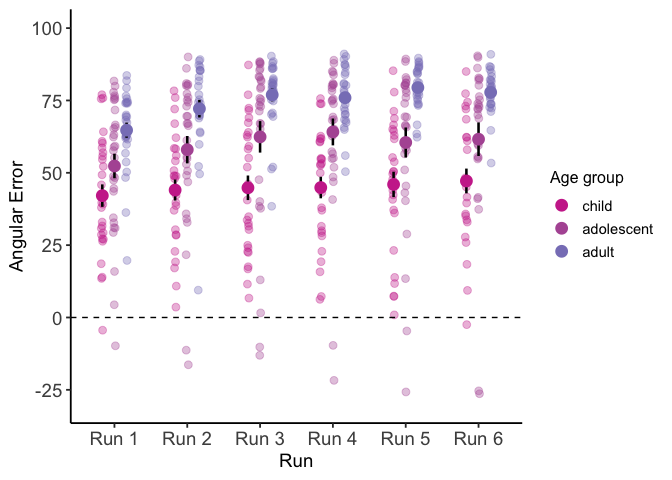
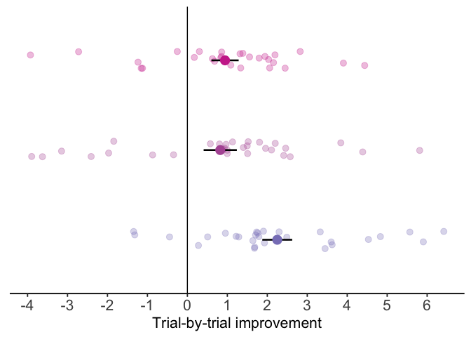
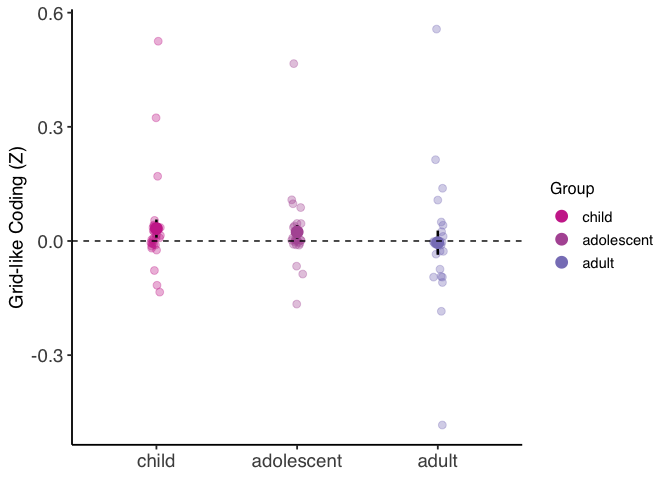
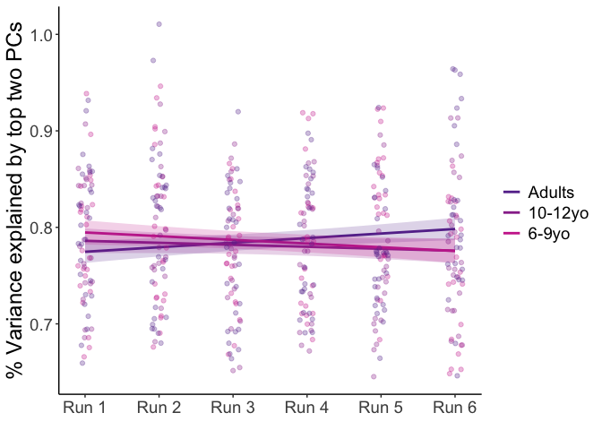

full main text analysis code: Hippocampal development enhances spatial
memory precision and generalization
================
2025-12-30

# Project information:

This study assesses hippocampal, entorhinal, and neocortical
representations and computations which support spatial memory
development. Children (6-9 years), adolescents (10-12 years), and adults
(18-34) completed a flexible spatial memory task in which they freely
navigated to consistently changing goal locations while undergoing fMRI.
For additional task details, see main text. Analyses below characterize
behavioral differences by age group, grid-like coding in entorhinal
cortex, and the compression of cognitive maps into low-dimensional
spaces. Additional Python analysis code is provided at OSF LINK which
can be run in a high-performance computing environment to implement
grid-coding searchlight analyses and voxelwise mixed-effects models to
characterize dimensionality.

## The below code is split into 5 primary sections:

### 1) Behavioral differences in flexible spatial navigation

### 2) Differentiation of item-level neural representations across learning runs

### 3) Integration of item-level neural representations across learning phases

### 4) Age differences in grid-like spatial representation in entorhinal cortex

### 5) Compression of spatial information into low-dimensional cognitive maps

Analyses are described in the order that they appear in the main text.
For expanded descriptions of analysis logic and approach, see main text
or Materials & Methods sections. Feel free to contact
<ofriend@utexas.edu> with any additional questions.

# 1) Behavioral differences in flexible spatial navigation

### Load behavioral data. Data frame includes following fields:

- subject - unique identifier for each participant
- age - numerical age, rounded to two decimal places
- run - run number of scanning protoco, 1-6 for most subjects
- test_trial - trial \# of navigation task, ranges from 1-12
- condition - 1: landmark close, 2: landmark far, 3: mountain center, 4:
  mountain side (see methods)
- repetition - repetition of specific condition (ranges from 1-3 for
  each condition)
- distance - unscaled distance error in virtual meters
- goalx - goal x-coordinate for trial
- goaly - goal y-coordinate for trial
- nav_x - recalled x-coordinate for trial
- nav_y - recalled y-coordinate for trial
- scaled_accuracy - behavioral index of navigation precision (see
  methods)
- chance_dist - the distance error expected by chance (vm)
- distance_traveled - total distance traveled during a trial (vm)
- euclidean_path - shortest path between spawn and goal locations (vm)
- nav_time - time spent navigating from spawn to recalled location (s)
- path_efficiency - distance_traveled - euclidean_path
- spawn_x - spawn x-coordinate for trial
- spawn_y - spawn y-coordinate for trial
- cone_x - cone x-coordinate for trial
- cone_y - cone y-coordinate for trial
- angular_error - an additional measure of precision (see methods)

``` r
data <- read.csv('data/master_behavior.csv')

data <- data %>%
  mutate(
    age_group = case_when(
      age >= 6  & age < 10  ~ "child",
      age >= 10 & age < 13 ~ "adolescent",
      age >= 18             ~ "adult",
    )
  )

group_colors <- c(
  "child"      = "#cc3399",
  "adolescent" = "#b25aa3",
  "adult"      = "#8881c1"
)
df <- data %>%
  group_by(subject, age_group, run) %>%
  summarise(across(where(is.numeric),
                   ~ mean(.x, na.rm = TRUE)),
            .groups = "drop")


df$run <- as.factor(df$run)
df$run_numeric <- as.numeric(df$run)
df$age_group <- relevel(factor(df$age_group), ref = 'adult')
```

### Initial learning (runs 1-3)

``` r
# overall group/run differences
m <- lmer(navigation_accuracy ~ run * age_group + (1|subject), data = df)
summary(m)
```

    ## Linear mixed model fit by REML. t-tests use Satterthwaite's method ['lmerModLmerTest']
    ## Formula: navigation_accuracy ~ run * age_group + (1 | subject)
    ##    Data: df
    ## 
    ## REML criterion at convergence: 4150.6
    ## 
    ## Scaled residuals: 
    ##     Min      1Q  Median      3Q     Max 
    ## -3.8971 -0.4484  0.1179  0.5457  2.7581 
    ## 
    ## Random effects:
    ##  Groups   Name        Variance Std.Dev.
    ##  subject  (Intercept) 268.0    16.37   
    ##  Residual             172.6    13.14   
    ## Number of obs: 506, groups:  subject, 86
    ## 
    ## Fixed effects:
    ##                          Estimate Std. Error       df t value Pr(>|t|)    
    ## (Intercept)               64.7232     3.9669 174.0313  16.316  < 2e-16 ***
    ## run2                       7.4272     3.5112 405.1657   2.115 0.035014 *  
    ## run3                      12.2116     3.5112 405.1657   3.478 0.000560 ***
    ## run4                      11.2069     3.5112 405.1657   3.192 0.001524 ** 
    ## run5                      14.2383     3.5505 405.6510   4.010 7.22e-05 ***
    ## run6                      12.5926     3.5505 405.6510   3.547 0.000436 ***
    ## age_groupadolescent      -12.3758     5.5158 174.0313  -2.244 0.026113 *  
    ## age_groupchild           -22.6096     5.6101 174.0313  -4.030 8.32e-05 ***
    ## run2:age_groupadolescent  -1.7871     4.8821 405.1657  -0.366 0.714516    
    ## run3:age_groupadolescent  -2.1380     4.8821 405.1657  -0.438 0.661668    
    ## run4:age_groupadolescent   0.5685     4.8821 405.1657   0.116 0.907358    
    ## run5:age_groupadolescent  -6.2692     4.9349 405.6352  -1.270 0.204676    
    ## run6:age_groupadolescent  -3.0104     5.0162 406.1146  -0.600 0.548750    
    ## run2:age_groupchild       -5.4997     4.9656 405.1657  -1.108 0.268704    
    ## run3:age_groupchild       -9.5077     4.9656 405.1657  -1.915 0.056231 .  
    ## run4:age_groupchild       -8.4209     4.9656 405.1657  -1.696 0.090682 .  
    ## run5:age_groupchild      -10.9358     5.0211 405.6510  -2.178 0.029984 *  
    ## run6:age_groupchild       -8.3771     5.0499 405.8202  -1.659 0.097914 .  
    ## ---
    ## Signif. codes:  0 '***' 0.001 '**' 0.01 '*' 0.05 '.' 0.1 ' ' 1

    ## 
    ## Correlation matrix not shown by default, as p = 18 > 12.
    ## Use print(x, correlation=TRUE)  or
    ##     vcov(x)        if you need it

``` r
anova(m)
```

    ## Type III Analysis of Variance Table with Satterthwaite's method
    ##               Sum Sq Mean Sq NumDF  DenDF F value    Pr(>F)    
    ## run           5221.0  1044.2     5 405.55  6.0499 2.041e-05 ***
    ## age_group     7184.1  3592.1     2  83.16 20.8119 4.696e-08 ***
    ## run:age_group 1449.5   144.9    10 405.55  0.8398    0.5904    
    ## ---
    ## Signif. codes:  0 '***' 0.001 '**' 0.01 '*' 0.05 '.' 0.1 ' ' 1

``` r
# runs 1-3
sub <- subset(df, run_numeric < 4)
m <- lmer(navigation_accuracy ~ run * age_group + (1|subject), data = sub)
summary(m)
```

    ## Linear mixed model fit by REML. t-tests use Satterthwaite's method ['lmerModLmerTest']
    ## Formula: navigation_accuracy ~ run * age_group + (1 | subject)
    ##    Data: sub
    ## 
    ## REML criterion at convergence: 2164.7
    ## 
    ## Scaled residuals: 
    ##     Min      1Q  Median      3Q     Max 
    ## -3.4029 -0.3617  0.1040  0.5271  2.0327 
    ## 
    ## Random effects:
    ##  Groups   Name        Variance Std.Dev.
    ##  subject  (Intercept) 277.1    16.65   
    ##  Residual             171.8    13.11   
    ## Number of obs: 258, groups:  subject, 86
    ## 
    ## Fixed effects:
    ##                          Estimate Std. Error      df t value Pr(>|t|)    
    ## (Intercept)                64.723      4.004 141.308  16.164  < 2e-16 ***
    ## run2                        7.427      3.503 166.000   2.120 0.035483 *  
    ## run3                       12.212      3.503 166.000   3.486 0.000628 ***
    ## age_groupadolescent       -12.376      5.568 141.308  -2.223 0.027819 *  
    ## age_groupchild            -22.610      5.663 141.308  -3.993 0.000105 ***
    ## run2:age_groupadolescent   -1.787      4.871 166.000  -0.367 0.714172    
    ## run3:age_groupadolescent   -2.138      4.871 166.000  -0.439 0.661285    
    ## run2:age_groupchild        -5.500      4.954 166.000  -1.110 0.268567    
    ## run3:age_groupchild        -9.508      4.954 166.000  -1.919 0.056690 .  
    ## ---
    ## Signif. codes:  0 '***' 0.001 '**' 0.01 '*' 0.05 '.' 0.1 ' ' 1
    ## 
    ## Correlation of Fixed Effects:
    ##             (Intr) run2   run3   ag_grpd ag_grpc rn2:g_grpd rn3:g_grpd rn2:g_grpc
    ## run2        -0.437                                                               
    ## run3        -0.437  0.500                                                        
    ## ag_grpdlscn -0.719  0.315  0.315                                                 
    ## age_grpchld -0.707  0.309  0.309  0.509                                          
    ## rn2:g_grpdl  0.315 -0.719 -0.360 -0.437  -0.222                                  
    ## rn3:g_grpdl  0.315 -0.360 -0.719 -0.437  -0.222   0.500                          
    ## rn2:g_grpch  0.309 -0.707 -0.354 -0.222  -0.437   0.509      0.254               
    ## rn3:g_grpch  0.309 -0.354 -0.707 -0.222  -0.437   0.254      0.509      0.500

``` r
anova(m)
```

    ## Type III Analysis of Variance Table with Satterthwaite's method
    ##               Sum Sq Mean Sq NumDF DenDF F value    Pr(>F)    
    ## run           3020.1 1510.06     2   166  8.7888 0.0002355 ***
    ## age_group     5484.3 2742.14     2    83 15.9598 1.366e-06 ***
    ## run:age_group  706.4  176.59     4   166  1.0278 0.3945757    
    ## ---
    ## Signif. codes:  0 '***' 0.001 '**' 0.01 '*' 0.05 '.' 0.1 ' ' 1

``` r
anova_results <- anova(m)
eta_sq_results <- eta_squared(m, partial = TRUE)
eta_sq_results <- as.data.frame(eta_sq_results)
eta_sq_results[] <- lapply(eta_sq_results, \(x) if(is.numeric(x)) round(x, 3) else x)
eta_sq_results
```

    ##       Parameter Eta2_partial   CI CI_low CI_high
    ## 1           run        0.096 0.95  0.032       1
    ## 2     age_group        0.278 0.95  0.143       1
    ## 3 run:age_group        0.024 0.95  0.000       1

``` r
emm <- emmeans(m, ~ run | age_group)
pair_tests <- pairs(emm, adjust = "bonferroni")
summary(pair_tests)
```

    ## age_group = adult:
    ##  contrast    estimate   SE  df t.ratio p.value
    ##  run1 - run2   -7.427 3.50 166  -2.120  0.1065
    ##  run1 - run3  -12.212 3.50 166  -3.486  0.0019
    ##  run2 - run3   -4.784 3.50 166  -1.366  0.5216
    ## 
    ## age_group = adolescent:
    ##  contrast    estimate   SE  df t.ratio p.value
    ##  run1 - run2   -5.640 3.38 166  -1.666  0.2925
    ##  run1 - run3  -10.074 3.38 166  -2.976  0.0101
    ##  run2 - run3   -4.433 3.38 166  -1.310  0.5761
    ## 
    ## age_group = child:
    ##  contrast    estimate   SE  df t.ratio p.value
    ##  run1 - run2   -1.927 3.50 166  -0.550  1.0000
    ##  run1 - run3   -2.704 3.50 166  -0.772  1.0000
    ##  run2 - run3   -0.776 3.50 166  -0.222  1.0000
    ## 
    ## Degrees-of-freedom method: kenward-roger 
    ## P value adjustment: bonferroni method for 3 tests

``` r
es <- emmeans::eff_size(emm, sigma = sigma(m), edf = df.residual(m))
es
```

    ## age_group = adult:
    ##  contrast    effect.size    SE  df lower.CL upper.CL
    ##  run1 - run2     -0.5666 0.268 141   -1.097  -0.0359
    ##  run1 - run3     -0.9316 0.271 141   -1.466  -0.3968
    ##  run2 - run3     -0.3650 0.268 141   -0.894   0.1643
    ## 
    ## age_group = adolescent:
    ##  contrast    effect.size    SE  df lower.CL upper.CL
    ##  run1 - run2     -0.4303 0.259 141   -0.942   0.0816
    ##  run1 - run3     -0.7685 0.261 141   -1.284  -0.2535
    ##  run2 - run3     -0.3382 0.259 141   -0.850   0.1731
    ## 
    ## age_group = child:
    ##  contrast    effect.size    SE  df lower.CL upper.CL
    ##  run1 - run2     -0.1470 0.267 141   -0.676   0.3815
    ##  run1 - run3     -0.2063 0.267 141   -0.735   0.3224
    ##  run2 - run3     -0.0592 0.267 141   -0.588   0.4691
    ## 
    ## sigma used for effect sizes: 13.11 
    ## Degrees-of-freedom method: inherited from kenward-roger when re-gridding 
    ## Confidence level used: 0.95

### Late learning (runs 4-6)

``` r
# runs 4-6
sub <- subset(df, run_numeric > 3)
m <- lmer(navigation_accuracy ~ run * age_group + (1|subject), data = sub)
summary(m)
```

    ## Linear mixed model fit by REML. t-tests use Satterthwaite's method ['lmerModLmerTest']
    ## Formula: navigation_accuracy ~ run * age_group + (1 | subject)
    ##    Data: sub
    ## 
    ## REML criterion at convergence: 2036.5
    ## 
    ## Scaled residuals: 
    ##     Min      1Q  Median      3Q     Max 
    ## -3.4052 -0.3949  0.0404  0.4750  2.6291 
    ## 
    ## Random effects:
    ##  Groups   Name        Variance Std.Dev.
    ##  subject  (Intercept) 303.0    17.41   
    ##  Residual             127.4    11.29   
    ## Number of obs: 248, groups:  subject, 86
    ## 
    ## Fixed effects:
    ##                          Estimate Std. Error      df t value Pr(>|t|)    
    ## (Intercept)                75.930      3.921 123.755  19.367  < 2e-16 ***
    ## run5                        3.254      3.063 158.285   1.062   0.2897    
    ## run6                        1.609      3.063 158.285   0.525   0.6002    
    ## age_groupadolescent       -11.807      5.452 123.755  -2.166   0.0322 *  
    ## age_groupchild            -31.030      5.545 123.755  -5.596 1.34e-07 ***
    ## run5:age_groupadolescent   -7.127      4.257 158.241  -1.674   0.0961 .  
    ## run6:age_groupadolescent   -3.208      4.341 158.885  -0.739   0.4610    
    ## run5:age_groupchild        -2.560      4.332 158.285  -0.591   0.5554    
    ## run6:age_groupchild        -0.304      4.362 158.512  -0.070   0.9445    
    ## ---
    ## Signif. codes:  0 '***' 0.001 '**' 0.01 '*' 0.05 '.' 0.1 ' ' 1
    ## 
    ## Correlation of Fixed Effects:
    ##             (Intr) run5   run6   ag_grpd ag_grpc rn5:g_grpd rn6:g_grpd rn5:g_grpc
    ## run5        -0.379                                                               
    ## run6        -0.379  0.497                                                        
    ## ag_grpdlscn -0.719  0.272  0.272                                                 
    ## age_grpchld -0.707  0.268  0.268  0.509                                          
    ## rn5:g_grpdl  0.273 -0.720 -0.358 -0.379  -0.193                                  
    ## rn6:g_grpdl  0.267 -0.351 -0.706 -0.372  -0.189   0.488                          
    ## rn5:g_grpch  0.268 -0.707 -0.352 -0.193  -0.379   0.509      0.248               
    ## rn6:g_grpch  0.266 -0.349 -0.702 -0.191  -0.376   0.251      0.496      0.494

``` r
anova(m)
```

    ## Type III Analysis of Variance Table with Satterthwaite's method
    ##               Sum Sq Mean Sq NumDF  DenDF F value    Pr(>F)    
    ## run              9.6    4.80     2 158.22  0.0377    0.9630    
    ## age_group     5239.5 2619.74     2  83.71 20.5687 5.419e-08 ***
    ## run:age_group  377.1   94.28     4 158.21  0.7402    0.5659    
    ## ---
    ## Signif. codes:  0 '***' 0.001 '**' 0.01 '*' 0.05 '.' 0.1 ' ' 1

``` r
anova_results <- anova(m)
eta_sq_results <- eta_squared(m, partial = TRUE)
eta_sq_results <- as.data.frame(eta_sq_results)
eta_sq_results[] <- lapply(eta_sq_results, \(x) if(is.numeric(x)) round(x, 3) else x)
eta_sq_results
```

    ##       Parameter Eta2_partial   CI CI_low CI_high
    ## 1           run        0.000 0.95  0.000       1
    ## 2     age_group        0.330 0.95  0.192       1
    ## 3 run:age_group        0.018 0.95  0.000       1

``` r
emm <- emmeans(m, ~ run | age_group)
pair_tests <- pairs(emm, adjust = "bonferroni")
summary(pair_tests)
```

    ## age_group = adult:
    ##  contrast    estimate   SE  df t.ratio p.value
    ##  run4 - run5   -3.254 3.06 157  -1.062  0.8694
    ##  run4 - run6   -1.609 3.06 157  -0.525  1.0000
    ##  run5 - run6    1.646 3.07 156   0.536  1.0000
    ## 
    ## age_group = adolescent:
    ##  contrast    estimate   SE  df t.ratio p.value
    ##  run4 - run5    3.872 2.96 157   1.310  0.5767
    ##  run4 - run6    1.599 3.08 159   0.520  1.0000
    ##  run5 - run6   -2.273 3.08 158  -0.737  1.0000
    ## 
    ## age_group = child:
    ##  contrast    estimate   SE  df t.ratio p.value
    ##  run4 - run5   -0.694 3.06 157  -0.226  1.0000
    ##  run4 - run6   -1.305 3.11 158  -0.420  1.0000
    ##  run5 - run6   -0.611 3.11 157  -0.196  1.0000
    ## 
    ## Degrees-of-freedom method: kenward-roger 
    ## P value adjustment: bonferroni method for 3 tests

``` r
es <- emmeans::eff_size(emm, sigma = sigma(m), edf = df.residual(m))
es
```

    ## age_group = adult:
    ##  contrast    effect.size    SE  df lower.CL upper.CL
    ##  run4 - run5     -0.2884 0.272 123   -0.826    0.250
    ##  run4 - run6     -0.1425 0.272 123   -0.680    0.395
    ##  run5 - run6      0.1458 0.272 126   -0.393    0.685
    ## 
    ## age_group = adolescent:
    ##  contrast    effect.size    SE  df lower.CL upper.CL
    ##  run4 - run5      0.3431 0.262 123   -0.176    0.863
    ##  run4 - run6      0.1417 0.273 123   -0.398    0.681
    ##  run5 - run6     -0.2014 0.273 126   -0.742    0.339
    ## 
    ## age_group = child:
    ##  contrast    effect.size    SE  df lower.CL upper.CL
    ##  run4 - run5     -0.0615 0.271 123   -0.599    0.476
    ##  run4 - run6     -0.1156 0.275 123   -0.660    0.429
    ##  run5 - run6     -0.0541 0.276 126   -0.600    0.492
    ## 
    ## sigma used for effect sizes: 11.29 
    ## Degrees-of-freedom method: inherited from kenward-roger when re-gridding 
    ## Confidence level used: 0.95

### Generalization of object sets

``` r
# repetition 1, run 1, vs repetition 1, run 4
data$run_numeric <- as.numeric(data$run)
data$run <- as.factor(data$run)
sub <- subset(data, repetition == 1)
sub <- subset(sub, run_numeric %in% c (1, 4))


m <- lmer(navigation_accuracy ~ run * age_group + (1|subject), data = sub)
summary(m)
```

    ## Linear mixed model fit by REML. t-tests use Satterthwaite's method ['lmerModLmerTest']
    ## Formula: navigation_accuracy ~ run * age_group + (1 | subject)
    ##    Data: sub
    ## 
    ## REML criterion at convergence: 7183.8
    ## 
    ## Scaled residuals: 
    ##     Min      1Q  Median      3Q     Max 
    ## -2.8363 -0.7709  0.3624  0.7140  1.6641 
    ## 
    ## Random effects:
    ##  Groups   Name        Variance Std.Dev.
    ##  subject  (Intercept)  100.6   10.03   
    ##  Residual             2024.7   45.00   
    ## Number of obs: 688, groups:  subject, 86
    ## 
    ## Fixed effects:
    ##                     Estimate Std. Error      df t value Pr(>|t|)    
    ## (Intercept)           45.675      4.497 228.097  10.156  < 2e-16 ***
    ## run4                  12.390      5.809 599.000   2.133  0.03333 *  
    ## age_groupadult         0.814      6.473 228.097   0.126  0.90003    
    ## age_groupchild        -8.212      6.473 228.097  -1.269  0.20586    
    ## run4:age_groupadult    9.681      8.361 599.000   1.158  0.24734    
    ## run4:age_groupchild  -21.841      8.361 599.000  -2.612  0.00922 ** 
    ## ---
    ## Signif. codes:  0 '***' 0.001 '**' 0.01 '*' 0.05 '.' 0.1 ' ' 1
    ## 
    ## Correlation of Fixed Effects:
    ##             (Intr) run4   ag_grpd ag_grpc rn4:g_grpd
    ## run4        -0.646                                  
    ## age_gropdlt -0.695  0.449                           
    ## age_grpchld -0.695  0.449  0.483                    
    ## rn4:g_grpdl  0.449 -0.695 -0.646  -0.312            
    ## rn4:g_grpch  0.449 -0.695 -0.312  -0.646   0.483

``` r
anova(m)
```

    ## Type III Analysis of Variance Table with Satterthwaite's method
    ##               Sum Sq Mean Sq NumDF DenDF F value    Pr(>F)    
    ## run            11942   11942     1   599  5.8984 0.0154483 *  
    ## age_group      54317   27158     2    83 13.4138 8.958e-06 ***
    ## run:age_group  29267   14634     2   599  7.2277 0.0007913 ***
    ## ---
    ## Signif. codes:  0 '***' 0.001 '**' 0.01 '*' 0.05 '.' 0.1 ' ' 1

``` r
anova_results <- anova(m)
eta_sq_results <- eta_squared(m, partial = TRUE)
eta_sq_results <- as.data.frame(eta_sq_results)
eta_sq_results[] <- lapply(eta_sq_results, \(x) if(is.numeric(x)) round(x, 3) else x)
eta_sq_results
```

    ##       Parameter Eta2_partial   CI CI_low CI_high
    ## 1           run        0.010 0.95  0.001       1
    ## 2     age_group        0.244 0.95  0.114       1
    ## 3 run:age_group        0.024 0.95  0.006       1

``` r
emm <- emmeans(m, ~ run | age_group)
pair_tests <- pairs(emm, adjust = "bonferroni")
summary(pair_tests)
```

    ## age_group = adolescent:
    ##  contrast    estimate   SE  df t.ratio p.value
    ##  run1 - run4   -12.39 5.81 599  -2.133  0.0333
    ## 
    ## age_group = adult:
    ##  contrast    estimate   SE  df t.ratio p.value
    ##  run1 - run4   -22.07 6.01 599  -3.671  0.0003
    ## 
    ## age_group = child:
    ##  contrast    estimate   SE  df t.ratio p.value
    ##  run1 - run4     9.45 6.01 599   1.572  0.1165
    ## 
    ## Degrees-of-freedom method: kenward-roger

``` r
es <- emmeans::eff_size(emm, sigma = sigma(m), edf = df.residual(m))
es
```

    ## age_group = adolescent:
    ##  contrast    effect.size    SE  df lower.CL upper.CL
    ##  run1 - run4      -0.275 0.129 228  -0.5302  -0.0206
    ## 
    ## age_group = adult:
    ##  contrast    effect.size    SE  df lower.CL upper.CL
    ##  run1 - run4      -0.491 0.134 228  -0.7551  -0.2259
    ## 
    ## age_group = child:
    ##  contrast    effect.size    SE  df lower.CL upper.CL
    ##  run1 - run4       0.210 0.134 228  -0.0535   0.4736
    ## 
    ## sigma used for effect sizes: 45 
    ## Degrees-of-freedom method: inherited from kenward-roger when re-gridding 
    ## Confidence level used: 0.95

<!-- -->

### Trial-by-trial improvement

``` r
data <- read.csv('data/imp_score.csv')

data <- data %>%
  mutate(
    age_group = case_when(
      age >= 6  & age < 10  ~ "child",
      age >= 10 & age < 13 ~ "adolescent",
      age >= 18             ~ "adult",
    )
  )
data$run <- as.factor(data$run)
```

``` r
m <- lmer(imp_score ~ age_group + run + (1|subject), data = data)
summary(m)
```

    ## Linear mixed model fit by REML. t-tests use Satterthwaite's method ['lmerModLmerTest']
    ## Formula: imp_score ~ age_group + run + (1 | subject)
    ##    Data: data
    ## 
    ## REML criterion at convergence: 2170.8
    ## 
    ## Scaled residuals: 
    ##     Min      1Q  Median      3Q     Max 
    ## -4.6288 -0.4269 -0.0070  0.4166  4.5454 
    ## 
    ## Random effects:
    ##  Groups   Name        Variance Std.Dev.
    ##  subject  (Intercept) 3.617    1.902   
    ##  Residual             3.039    1.743   
    ## Number of obs: 505, groups:  subject, 86
    ## 
    ## Fixed effects:
    ##                Estimate Std. Error       df t value Pr(>|t|)    
    ## (Intercept)      2.0112     0.4090 120.5520   4.918 2.80e-06 ***
    ## age_groupadult   1.4379     0.5345  82.6643   2.690  0.00863 ** 
    ## age_groupchild   0.1090     0.5347  82.8024   0.204  0.83891    
    ## run2            -1.0893     0.2658 413.7285  -4.098 5.03e-05 ***
    ## run3            -1.6127     0.2658 413.7285  -6.067 2.95e-09 ***
    ## run4            -1.3643     0.2658 413.7285  -5.132 4.41e-07 ***
    ## run5            -1.4974     0.2687 414.3304  -5.572 4.53e-08 ***
    ## run6            -1.6280     0.2738 415.0174  -5.946 5.83e-09 ***
    ## ---
    ## Signif. codes:  0 '***' 0.001 '**' 0.01 '*' 0.05 '.' 0.1 ' ' 1
    ## 
    ## Correlation of Fixed Effects:
    ##             (Intr) ag_grpd ag_grpc run2   run3   run4   run5  
    ## age_gropdlt -0.631                                            
    ## age_grpchld -0.631  0.483                                     
    ## run2        -0.325  0.000   0.000                             
    ## run3        -0.325  0.000   0.000   0.500                     
    ## run4        -0.325  0.000   0.000   0.500  0.500              
    ## run5        -0.322  0.000   0.000   0.495  0.495  0.495       
    ## run6        -0.313 -0.005  -0.001   0.485  0.485  0.485  0.484

``` r
anova(m)
```

    ## Type III Analysis of Variance Table with Satterthwaite's method
    ##            Sum Sq Mean Sq NumDF  DenDF F value    Pr(>F)    
    ## age_group  26.754  13.377     2  82.70  4.4023   0.01525 *  
    ## run       162.982  32.596     5 414.27 10.7273 1.036e-09 ***
    ## ---
    ## Signif. codes:  0 '***' 0.001 '**' 0.01 '*' 0.05 '.' 0.1 ' ' 1

``` r
anova_results <- anova(m)
eta_sq_results <- eta_squared(m, partial = TRUE)
eta_sq_results <- as.data.frame(eta_sq_results)
eta_sq_results[] <- lapply(eta_sq_results, \(x) if(is.numeric(x)) round(x, 3) else x)
eta_sq_results
```

    ##   Parameter Eta2_partial   CI CI_low CI_high
    ## 1 age_group        0.096 0.95  0.011       1
    ## 2       run        0.115 0.95  0.063       1

``` r
emm <- emmeans(m, ~ run | age_group)
pair_tests <- pairs(emm, adjust = "bonferroni")
summary(pair_tests)
```

    ## age_group = adolescent:
    ##  contrast    estimate    SE  df t.ratio p.value
    ##  run1 - run2   1.0893 0.266 414   4.098  0.0008
    ##  run1 - run3   1.6127 0.266 414   6.067  <.0001
    ##  run1 - run4   1.3643 0.266 414   5.132  <.0001
    ##  run1 - run5   1.4974 0.269 415   5.572  <.0001
    ##  run1 - run6   1.6280 0.274 415   5.946  <.0001
    ##  run2 - run3   0.5234 0.266 414   1.969  0.7443
    ##  run2 - run4   0.2751 0.266 414   1.035  1.0000
    ##  run2 - run5   0.4081 0.269 415   1.519  1.0000
    ##  run2 - run6   0.5387 0.274 415   1.968  0.7466
    ##  run3 - run4  -0.2483 0.266 414  -0.934  1.0000
    ##  run3 - run5  -0.1153 0.269 415  -0.429  1.0000
    ##  run3 - run6   0.0153 0.274 415   0.056  1.0000
    ##  run4 - run5   0.1330 0.269 415   0.495  1.0000
    ##  run4 - run6   0.2637 0.274 415   0.963  1.0000
    ##  run5 - run6   0.1306 0.276 415   0.474  1.0000
    ## 
    ## age_group = adult:
    ##  contrast    estimate    SE  df t.ratio p.value
    ##  run1 - run2   1.0893 0.266 414   4.098  0.0008
    ##  run1 - run3   1.6127 0.266 414   6.067  <.0001
    ##  run1 - run4   1.3643 0.266 414   5.132  <.0001
    ##  run1 - run5   1.4974 0.269 415   5.572  <.0001
    ##  run1 - run6   1.6280 0.274 415   5.946  <.0001
    ##  run2 - run3   0.5234 0.266 414   1.969  0.7443
    ##  run2 - run4   0.2751 0.266 414   1.035  1.0000
    ##  run2 - run5   0.4081 0.269 415   1.519  1.0000
    ##  run2 - run6   0.5387 0.274 415   1.968  0.7466
    ##  run3 - run4  -0.2483 0.266 414  -0.934  1.0000
    ##  run3 - run5  -0.1153 0.269 415  -0.429  1.0000
    ##  run3 - run6   0.0153 0.274 415   0.056  1.0000
    ##  run4 - run5   0.1330 0.269 415   0.495  1.0000
    ##  run4 - run6   0.2637 0.274 415   0.963  1.0000
    ##  run5 - run6   0.1306 0.276 415   0.474  1.0000
    ## 
    ## age_group = child:
    ##  contrast    estimate    SE  df t.ratio p.value
    ##  run1 - run2   1.0893 0.266 414   4.098  0.0008
    ##  run1 - run3   1.6127 0.266 414   6.067  <.0001
    ##  run1 - run4   1.3643 0.266 414   5.132  <.0001
    ##  run1 - run5   1.4974 0.269 415   5.572  <.0001
    ##  run1 - run6   1.6280 0.274 415   5.946  <.0001
    ##  run2 - run3   0.5234 0.266 414   1.969  0.7443
    ##  run2 - run4   0.2751 0.266 414   1.035  1.0000
    ##  run2 - run5   0.4081 0.269 415   1.519  1.0000
    ##  run2 - run6   0.5387 0.274 415   1.968  0.7466
    ##  run3 - run4  -0.2483 0.266 414  -0.934  1.0000
    ##  run3 - run5  -0.1153 0.269 415  -0.429  1.0000
    ##  run3 - run6   0.0153 0.274 415   0.056  1.0000
    ##  run4 - run5   0.1330 0.269 415   0.495  1.0000
    ##  run4 - run6   0.2637 0.274 415   0.963  1.0000
    ##  run5 - run6   0.1306 0.276 415   0.474  1.0000
    ## 
    ## Degrees-of-freedom method: kenward-roger 
    ## P value adjustment: bonferroni method for 15 tests

``` r
es <- emmeans::eff_size(emm, sigma = sigma(m), edf = df.residual(m))
es
```

    ## age_group = adolescent:
    ##  contrast    effect.size    SE  df lower.CL upper.CL
    ##  run1 - run2     0.62487 0.154 121  0.32041    0.929
    ##  run1 - run3     0.92514 0.155 121  0.61766    1.233
    ##  run1 - run4     0.78267 0.155 121  0.47677    1.089
    ##  run1 - run5     0.85898 0.157 121  0.54904    1.169
    ##  run1 - run6     0.93393 0.160 121  0.61747    1.250
    ##  run2 - run3     0.30027 0.153 121 -0.00224    0.603
    ##  run2 - run4     0.15780 0.153 121 -0.14427    0.460
    ##  run2 - run5     0.23411 0.154 121 -0.07144    0.540
    ##  run2 - run6     0.30906 0.157 121 -0.00251    0.621
    ##  run3 - run4    -0.14246 0.153 121 -0.44451    0.160
    ##  run3 - run5    -0.06615 0.154 121 -0.37137    0.239
    ##  run3 - run6     0.00879 0.157 121 -0.30217    0.320
    ##  run4 - run5     0.07631 0.154 121 -0.22892    0.382
    ##  run4 - run6     0.15126 0.157 121 -0.15985    0.462
    ##  run5 - run6     0.07494 0.158 123 -0.23809    0.388
    ## 
    ## age_group = adult:
    ##  contrast    effect.size    SE  df lower.CL upper.CL
    ##  run1 - run2     0.62487 0.154 118  0.32034    0.929
    ##  run1 - run3     0.92514 0.155 118  0.61759    1.233
    ##  run1 - run4     0.78267 0.155 118  0.47670    1.089
    ##  run1 - run5     0.85898 0.157 118  0.54897    1.169
    ##  run1 - run6     0.93393 0.160 118  0.61739    1.250
    ##  run2 - run3     0.30027 0.153 118 -0.00231    0.603
    ##  run2 - run4     0.15780 0.153 118 -0.14435    0.460
    ##  run2 - run5     0.23411 0.154 118 -0.07151    0.540
    ##  run2 - run6     0.30906 0.157 118 -0.00259    0.621
    ##  run3 - run4    -0.14246 0.153 118 -0.44458    0.160
    ##  run3 - run5    -0.06615 0.154 118 -0.37145    0.239
    ##  run3 - run6     0.00879 0.157 118 -0.30224    0.320
    ##  run4 - run5     0.07631 0.154 118 -0.22899    0.382
    ##  run4 - run6     0.15126 0.157 118 -0.15992    0.462
    ##  run5 - run6     0.07494 0.158 120 -0.23816    0.388
    ## 
    ## age_group = child:
    ##  contrast    effect.size    SE  df lower.CL upper.CL
    ##  run1 - run2     0.62487 0.154 118  0.32034    0.929
    ##  run1 - run3     0.92514 0.155 118  0.61759    1.233
    ##  run1 - run4     0.78267 0.155 118  0.47670    1.089
    ##  run1 - run5     0.85898 0.157 118  0.54897    1.169
    ##  run1 - run6     0.93393 0.160 118  0.61739    1.250
    ##  run2 - run3     0.30027 0.153 118 -0.00231    0.603
    ##  run2 - run4     0.15780 0.153 118 -0.14434    0.460
    ##  run2 - run5     0.23411 0.154 118 -0.07151    0.540
    ##  run2 - run6     0.30906 0.157 118 -0.00258    0.621
    ##  run3 - run4    -0.14246 0.153 118 -0.44458    0.160
    ##  run3 - run5    -0.06615 0.154 118 -0.37145    0.239
    ##  run3 - run6     0.00879 0.157 118 -0.30224    0.320
    ##  run4 - run5     0.07631 0.154 118 -0.22899    0.382
    ##  run4 - run6     0.15126 0.157 118 -0.15992    0.462
    ##  run5 - run6     0.07494 0.158 120 -0.23816    0.388
    ## 
    ## sigma used for effect sizes: 1.743 
    ## Degrees-of-freedom method: inherited from kenward-roger when re-gridding 
    ## Confidence level used: 0.95

``` r
emm <- emmeans(m, ~ age_group)
pair_tests <- pairs(emm, adjust = "bonferroni")
summary(pair_tests)
```

    ##  contrast           estimate    SE   df t.ratio p.value
    ##  adolescent - adult   -1.438 0.534 83.0  -2.690  0.0259
    ##  adolescent - child   -0.109 0.535 83.1  -0.204  1.0000
    ##  adult - child         1.329 0.544 82.9   2.445  0.0498
    ## 
    ## Results are averaged over the levels of: run 
    ## Degrees-of-freedom method: kenward-roger 
    ## P value adjustment: bonferroni method for 3 tests

<!-- -->

# 2) Differentiation of item-level neural representations across learning runs

``` r
data <- read.csv('data/similarity_change_by_run.csv')

data$age_group <- relevel(factor(data$age_group), ref = '6-9yo')
m <- lm(differentiation ~ age_group, data = data)
summary(m)
```

    ## 
    ## Call:
    ## lm(formula = differentiation ~ age_group, data = data)
    ## 
    ## Residuals:
    ##      Min       1Q   Median       3Q      Max 
    ## -1.59509 -0.21837  0.01351  0.30458  0.98351 
    ## 
    ## Coefficients:
    ##                  Estimate Std. Error t value Pr(>|t|)   
    ## (Intercept)       0.14773    0.08604   1.717  0.08971 . 
    ## age_group10-12yo -0.26089    0.11963  -2.181  0.03203 * 
    ## age_groupAdults  -0.36201    0.12168  -2.975  0.00383 **
    ## ---
    ## Signif. codes:  0 '***' 0.001 '**' 0.01 '*' 0.05 '.' 0.1 ' ' 1
    ## 
    ## Residual standard error: 0.4553 on 83 degrees of freedom
    ## Multiple R-squared:  0.1022, Adjusted R-squared:  0.08061 
    ## F-statistic: 4.726 on 2 and 83 DF,  p-value: 0.01138

``` r
anova(m)
```

    ## Analysis of Variance Table
    ## 
    ## Response: differentiation
    ##           Df  Sum Sq Mean Sq F value  Pr(>F)  
    ## age_group  2  1.9594 0.97968  4.7264 0.01138 *
    ## Residuals 83 17.2039 0.20728                  
    ## ---
    ## Signif. codes:  0 '***' 0.001 '**' 0.01 '*' 0.05 '.' 0.1 ' ' 1

``` r
anova_results <- anova(m)
eta_sq_results <- eta_squared(m, partial = TRUE)
```

    ## For one-way between subjects designs, partial eta squared is equivalent to eta squared. Returning eta squared.

``` r
eta_sq_results <- as.data.frame(eta_sq_results)
eta_sq_results[] <- lapply(eta_sq_results, \(x) if(is.numeric(x)) round(x, 3) else x)
eta_sq_results
```

    ##   Parameter  Eta2   CI CI_low CI_high
    ## 1 age_group 0.102 0.95  0.014       1

``` r
# compare to 0
child <- subset(data, age_group == '6-9yo')
adolescent <- subset(data, age_group == '10-12yo')
adult <- subset(data, age_group == 'Adults')

t.test(child$differentiation, mu = 0, alternative = 'two.sided')
```

    ## 
    ##  One Sample t-test
    ## 
    ## data:  child$differentiation
    ## t = 1.6738, df = 27, p-value = 0.1057
    ## alternative hypothesis: true mean is not equal to 0
    ## 95 percent confidence interval:
    ##  -0.03336677  0.32882649
    ## sample estimates:
    ## mean of x 
    ## 0.1477299

``` r
t.test(adolescent$differentiation, mu = 0, alternative = 'two.sided')
```

    ## 
    ##  One Sample t-test
    ## 
    ## data:  adolescent$differentiation
    ## t = -1.464, df = 29, p-value = 0.154
    ## alternative hypothesis: true mean is not equal to 0
    ## 95 percent confidence interval:
    ##  -0.27125306  0.04492872
    ## sample estimates:
    ##  mean of x 
    ## -0.1131622

``` r
t.test(adult$differentiation, mu = 0, alternative = 'two.sided')
```

    ## 
    ##  One Sample t-test
    ## 
    ## data:  adult$differentiation
    ## t = -2.3822, df = 27, p-value = 0.02451
    ## alternative hypothesis: true mean is not equal to 0
    ## 95 percent confidence interval:
    ##  -0.39883384 -0.02971794
    ## sample estimates:
    ##  mean of x 
    ## -0.2142759

``` r
d_child <- cohens_d(t.test(child$differentiation, mu = 0))
round(d_child$Cohens_d, 3)
```

    ## [1] 0.316

``` r
d_adol <- cohens_d(t.test(adolescent$differentiation, mu = 0))
round(d_adol$Cohens_d, 3)
```

    ## [1] -0.267

``` r
d_adult <- cohens_d(t.test(adult$differentiation, mu = 0))
round(d_adult$Cohens_d, 3)
```

    ## [1] -0.45

# 3) Integration of item-level neural representations across learning phases

``` r
m <- lm(generalization ~ age_group, data = data)
summary(m)
```

    ## 
    ## Call:
    ## lm(formula = generalization ~ age_group, data = data)
    ## 
    ## Residuals:
    ##      Min       1Q   Median       3Q      Max 
    ## -0.61365 -0.10140  0.01617  0.12359  0.34609 
    ## 
    ## Coefficients:
    ##                  Estimate Std. Error t value Pr(>|t|)   
    ## (Intercept)      -0.09214    0.03501  -2.632  0.01012 * 
    ## age_group10-12yo  0.06699    0.04868   1.376  0.17249   
    ## age_groupAdults   0.16038    0.04951   3.239  0.00172 **
    ## ---
    ## Signif. codes:  0 '***' 0.001 '**' 0.01 '*' 0.05 '.' 0.1 ' ' 1
    ## 
    ## Residual standard error: 0.1853 on 83 degrees of freedom
    ## Multiple R-squared:  0.1132, Adjusted R-squared:  0.0918 
    ## F-statistic: 5.296 on 2 and 83 DF,  p-value: 0.006846

``` r
anova(m)
```

    ## Analysis of Variance Table
    ## 
    ## Response: generalization
    ##           Df  Sum Sq  Mean Sq F value   Pr(>F)   
    ## age_group  2 0.36352 0.181761  5.2957 0.006846 **
    ## Residuals 83 2.84877 0.034323                    
    ## ---
    ## Signif. codes:  0 '***' 0.001 '**' 0.01 '*' 0.05 '.' 0.1 ' ' 1

``` r
anova_results <- anova(m)
eta_sq_results <- eta_squared(m, partial = TRUE)
```

    ## For one-way between subjects designs, partial eta squared is equivalent to eta squared. Returning eta squared.

``` r
eta_sq_results <- as.data.frame(eta_sq_results)
eta_sq_results[] <- lapply(eta_sq_results, \(x) if(is.numeric(x)) round(x, 3) else x)
eta_sq_results
```

    ##   Parameter  Eta2   CI CI_low CI_high
    ## 1 age_group 0.113 0.95   0.02       1

``` r
child <- subset(data, age_group == '6-9yo')
adolescent <- subset(data, age_group == '10-12yo')
adult <- subset(data, age_group == 'Adults')

t.test(child$generalization, mu = 0, alternative = 'two.sided')
```

    ## 
    ##  One Sample t-test
    ## 
    ## data:  child$generalization
    ## t = -2.3472, df = 27, p-value = 0.0265
    ## alternative hypothesis: true mean is not equal to 0
    ## 95 percent confidence interval:
    ##  -0.17269345 -0.01159558
    ## sample estimates:
    ##   mean of x 
    ## -0.09214451

``` r
t.test(adolescent$generalization, mu = 0, alternative = 'two.sided')
```

    ## 
    ##  One Sample t-test
    ## 
    ## data:  adolescent$generalization
    ## t = -0.79593, df = 29, p-value = 0.4325
    ## alternative hypothesis: true mean is not equal to 0
    ## 95 percent confidence interval:
    ##  -0.08978805  0.03948117
    ## sample estimates:
    ##   mean of x 
    ## -0.02515344

``` r
t.test(adult$generalization, mu = 0, alternative = 'two.sided')
```

    ## 
    ##  One Sample t-test
    ## 
    ## data:  adult$generalization
    ## t = 2.0786, df = 27, p-value = 0.04729
    ## alternative hypothesis: true mean is not equal to 0
    ## 95 percent confidence interval:
    ##  0.0008782088 0.1355988935
    ## sample estimates:
    ##  mean of x 
    ## 0.06823855

``` r
d_child <- cohens_d(t.test(child$generalization, mu = 0))
round(d_child$Cohens_d, 3)
```

    ## [1] -0.444

``` r
d_adol <- cohens_d(t.test(adolescent$generalization, mu = 0))
round(d_adol$Cohens_d, 3)
```

    ## [1] -0.145

``` r
d_adult <- cohens_d(t.test(adult$generalization, mu = 0))
round(d_adult$Cohens_d, 3)
```

    ## [1] 0.393

# 4) Age differences in grid-like spatial representation in entorhinal cortex

``` r
data <- read.csv("data/erc_clust_vals.csv")

data <- data %>%
  mutate(group = case_when(
    age < 13 ~ 'child',
    age >= 18 ~ 'adult',
    TRUE ~ NA_character_  
  ))

child <- subset(data, group == 'child')
adult <- subset(data, group == 'adult')

t.test(child$difference_60_minus_30, mu = 0, alternative = 'greater')
```

    ## 
    ##  One Sample t-test
    ## 
    ## data:  child$difference_60_minus_30
    ## t = 1.8848, df = 56, p-value = 0.03232
    ## alternative hypothesis: true mean is greater than 0
    ## 95 percent confidence interval:
    ##  0.003165738         Inf
    ## sample estimates:
    ##  mean of x 
    ## 0.02810446

``` r
t.test(adult$difference_60_minus_30, mu = 0, alternative = 'greater')
```

    ## 
    ##  One Sample t-test
    ## 
    ## data:  adult$difference_60_minus_30
    ## t = -0.13405, df = 25, p-value = 0.5528
    ## alternative hypothesis: true mean is greater than 0
    ## 95 percent confidence interval:
    ##  -0.06070539         Inf
    ## sample estimates:
    ##    mean of x 
    ## -0.004417443

    ## [1] 20 57 59 64

    ## 
    ##  One Sample t-test
    ## 
    ## data:  chi$difference_60_minus_30
    ## t = 1.5764, df = 55, p-value = 0.06033
    ## alternative hypothesis: true mean is greater than 0
    ## 95 percent confidence interval:
    ##  -0.001178741          Inf
    ## sample estimates:
    ##  mean of x 
    ## 0.01923225

    ## 
    ##  One Sample t-test
    ## 
    ## data:  ad$difference_60_minus_30
    ## t = -0.23721, df = 22, p-value = 0.5927
    ## alternative hypothesis: true mean is greater than 0
    ## 95 percent confidence interval:
    ##  -0.03401989         Inf
    ## sample estimates:
    ##    mean of x 
    ## -0.004129232

    ## Scale for colour is already present.
    ## Adding another scale for colour, which will replace the existing scale.

    ## Warning: Removed 3 rows containing missing values or values outside the scale range (`geom_point()`).

<!-- -->

``` r
m  <- lm(scaled_accuracy ~ age + difference_60_minus_30, data = data)
summary(m)
```

    ## 
    ## Call:
    ## lm(formula = scaled_accuracy ~ age + difference_60_minus_30, 
    ##     data = data)
    ## 
    ## Residuals:
    ##     Min      1Q  Median      3Q     Max 
    ## -72.153  -8.949   1.826  10.594  30.339 
    ## 
    ## Coefficients:
    ##                        Estimate Std. Error t value Pr(>|t|)    
    ## (Intercept)             32.0530     4.7903   6.691 2.76e-09 ***
    ## age                      2.0132     0.3218   6.256 1.83e-08 ***
    ## difference_60_minus_30 -29.3429    14.2931  -2.053   0.0433 *  
    ## ---
    ## Signif. codes:  0 '***' 0.001 '**' 0.01 '*' 0.05 '.' 0.1 ' ' 1
    ## 
    ## Residual standard error: 17.12 on 80 degrees of freedom
    ##   (3 observations deleted due to missingness)
    ## Multiple R-squared:   0.35,  Adjusted R-squared:  0.3337 
    ## F-statistic: 21.54 on 2 and 80 DF,  p-value: 3.292e-08

``` r
anova_results <- anova(m)
eta_sq_results <- eta_squared(m, partial = TRUE)
eta_sq_results <- as.data.frame(eta_sq_results)
eta_sq_results[] <- lapply(eta_sq_results, \(x) if(is.numeric(x)) round(x, 3) else x)
eta_sq_results
```

    ##                Parameter Eta2_partial   CI CI_low CI_high
    ## 1                    age        0.327 0.95  0.194       1
    ## 2 difference_60_minus_30        0.050 0.95  0.001       1

``` r
m  <- lm(scaled_accuracy ~ age + difference_60_minus_30, data = data)

ggplot(data, aes(x = scaled_accuracy, y = difference_60_minus_30)) +
  # subject-level points
  geom_point(alpha = 0.3, size = 2, color = "#c04678") +
  geom_smooth(method = "lm",
              formula = y ~ x,
              se = TRUE,
              color = "#c04678",  
              fill = "#c04678") +  
  labs(
    x = "Scaled Accuracy",
    y = "Grid-like Coding (Z)"
  ) +
  theme_classic(base_size = 16)
```

    ## Warning: Removed 3 rows containing non-finite outside the scale range (`stat_smooth()`).

    ## Warning: Removed 3 rows containing missing values or values outside the scale range (`geom_point()`).

<!-- -->

# 5) Compression of spatial information into low-dimensional cognitive maps

- to identify regions which compress spatial information across the task
  (and do so differently by age group), we use voxelwise mixed-effects
  regression
  1)  for item-level representations within each subject, we iteratively
      sweep a searchlight sphere across the brain, perform PCA, and
      exteract the % of variance explained by the top 2 principal
      components
  2)  after transforming resulting variance maps into template space, we
      again iteratively sweet across the brain and implement a
      mixed-effects model with terms for age group, run, their
      interaction, and overall task performance, along with
      subject-level random intercept terms.
  3)  from the above comparison, we compute (1-p) maps to identify
      contiguous clusters in which we find an age group by run
      interaction
  4)  finally, we back-project the corrected cluster from above (in the
      hippocampal tail) into each subject’s native space to extract
      changes in variance and similarity between items
- this requires several millions of comparisons and must be implemented
  in parallel in high-performance computing (HPC) environment
- the below mixed-effects model is confirmatory, illustrating an
  age-by-run interaction within the hippocampal cluster identified via
  voxelwise mixed-effects regression
  - for voxelwise PCA searchlight, see associated Python files for
    implementation in HPC environments

``` r
data = read.csv('data/var_top2_PCs_by_run.csv')

# here we plot w/ run as continuous, but effect is identical when treating run as categorical
data$run <- as.numeric(data$run)
data$subject <- as.factor(data$subject)

# confirmatory model
data$age_group <- relevel(factor(data$age_group), ref = 'Adults')
m <- lmer(var12 ~ age_group*run + (1|subject), data = data)
summary(m)
```

    ## Linear mixed model fit by REML. t-tests use Satterthwaite's method ['lmerModLmerTest']
    ## Formula: var12 ~ age_group * run + (1 | subject)
    ##    Data: data
    ## 
    ## REML criterion at convergence: -1543.3
    ## 
    ## Scaled residuals: 
    ##     Min      1Q  Median      3Q     Max 
    ## -2.4387 -0.6348 -0.1553  0.5446  3.4131 
    ## 
    ## Random effects:
    ##  Groups   Name        Variance  Std.Dev.
    ##  subject  (Intercept) 0.0002695 0.01642 
    ##  Residual             0.0012667 0.03559 
    ## Number of obs: 432, groups:  subject, 72
    ## 
    ## Fixed effects:
    ##                        Estimate Std. Error         df t value Pr(>|t|)    
    ## (Intercept)            0.769977   0.007116 336.844983 108.197  < 2e-16 ***
    ## age_group10-12yo       0.018120   0.010621 336.844983   1.706 0.088908 .  
    ## age_group6-9yo         0.028539   0.010493 336.844983   2.720 0.006868 ** 
    ## run                    0.004723   0.001637 357.000001   2.884 0.004158 ** 
    ## age_group10-12yo:run  -0.006777   0.002444 357.000001  -2.773 0.005839 ** 
    ## age_group6-9yo:run    -0.008546   0.002414 357.000001  -3.540 0.000453 ***
    ## ---
    ## Signif. codes:  0 '***' 0.001 '**' 0.01 '*' 0.05 '.' 0.1 ' ' 1
    ## 
    ## Correlation of Fixed Effects:
    ##             (Intr) ag_10-12 ag_6-9 run    a_10-12:
    ## ag_grp10-12 -0.670                                
    ## age_grp6-9y -0.678  0.454                         
    ## run         -0.805  0.540    0.546                
    ## ag_gr10-12:  0.540 -0.805   -0.366 -0.670         
    ## ag_grp6-9y:  0.546 -0.366   -0.805 -0.678  0.454

``` r
anova(m)
```

    ## Type III Analysis of Variance Table with Satterthwaite's method
    ##                  Sum Sq   Mean Sq NumDF  DenDF F value    Pr(>F)    
    ## age_group     0.0097242 0.0048621     2 336.84  3.8383 0.0224785 *  
    ## run           0.0001851 0.0001851     1 357.00  0.1462 0.7024648    
    ## age_group:run 0.0180401 0.0090200     2 357.00  7.1207 0.0009282 ***
    ## ---
    ## Signif. codes:  0 '***' 0.001 '**' 0.01 '*' 0.05 '.' 0.1 ' ' 1

``` r
# effect size
anova_results <- anova(m)
eta_sq_results <- eta_squared(m, partial = TRUE)
eta_sq_results <- as.data.frame(eta_sq_results)
eta_sq_results[] <- lapply(eta_sq_results, \(x) if(is.numeric(x)) round(x, 3) else x)
eta_sq_results
```

    ##       Parameter Eta2_partial   CI CI_low CI_high
    ## 1     age_group        0.022 0.95  0.002       1
    ## 2           run        0.000 0.95  0.000       1
    ## 3 age_group:run        0.038 0.95  0.010       1

<!-- -->

``` r
# directional t-tests to identify correspondence between neural space and behavioral space
# see associated jupyter notebook for plotting of the below
data <- read.csv('data/task_neural_space_corr.csv')

data <- subset(data, run > 3)

data <- data %>%
  group_by(subject, age_group) %>%
  summarise(across(where(is.numeric), mean), .groups = "drop")

adu <- subset(data, age_group == 'Adults')
ado <- subset(data, age_group == '10-12yo')
chi <- subset(data, age_group == '6-9yo')

t.test(adu$z, mu = 0, alternative = 'greater')
```

    ## 
    ##  One Sample t-test
    ## 
    ## data:  adu$z
    ## t = 2.0867, df = 26, p-value = 0.02343
    ## alternative hypothesis: true mean is greater than 0
    ## 95 percent confidence interval:
    ##  0.02354701        Inf
    ## sample estimates:
    ## mean of x 
    ## 0.1289498

``` r
t.test(ado$z, mu = 0, alternative = 'greater')
```

    ## 
    ##  One Sample t-test
    ## 
    ## data:  ado$z
    ## t = 1.6302, df = 21, p-value = 0.05898
    ## alternative hypothesis: true mean is greater than 0
    ## 95 percent confidence interval:
    ##  -0.006030251          Inf
    ## sample estimates:
    ## mean of x 
    ## 0.1085814

``` r
t.test(chi$z, mu = 0, alternative = 'greater')
```

    ## 
    ##  One Sample t-test
    ## 
    ## data:  chi$z
    ## t = -0.38881, df = 22, p-value = 0.6494
    ## alternative hypothesis: true mean is greater than 0
    ## 95 percent confidence interval:
    ##  -0.111151       Inf
    ## sample estimates:
    ##   mean of x 
    ## -0.02052104

    ## Linear mixed model fit by REML. t-tests use Satterthwaite's method ['lmerModLmerTest']
    ## Formula: z ~ scaled_accuracy + age_group + (1 | subject)
    ##    Data: data
    ## 
    ## REML criterion at convergence: 321.8
    ## 
    ## Scaled residuals: 
    ##      Min       1Q   Median       3Q      Max 
    ## -2.69937 -0.70413 -0.02941  0.58165  2.87812 
    ## 
    ## Random effects:
    ##  Groups   Name        Variance Std.Dev.
    ##  subject  (Intercept) 0.005932 0.07702 
    ##  Residual             0.236591 0.48641 
    ## Number of obs: 214, groups:  subject, 72
    ## 
    ## Fixed effects:
    ##                    Estimate Std. Error         df t value Pr(>|t|)  
    ## (Intercept)       -0.261040   0.117799 116.284200  -2.216   0.0286 *
    ## scaled_accuracy    0.005150   0.002161 140.925692   2.383   0.0185 *
    ## age_group10-12yo   0.021093   0.097959  79.235020   0.215   0.8301  
    ## age_groupAdults   -0.011052   0.107162  91.646278  -0.103   0.9181  
    ## ---
    ## Signif. codes:  0 '***' 0.001 '**' 0.01 '*' 0.05 '.' 0.1 ' ' 1
    ## 
    ## Correlation of Fixed Effects:
    ##             (Intr) scld_c a_10-1
    ## scald_ccrcy -0.857              
    ## ag_grp10-12  0.077 -0.463       
    ## ag_grpAdlts  0.249 -0.631  0.643

    ## Warning: scaled_accuracy and age_group are not included in an interaction with one another in the model.

<!-- -->
