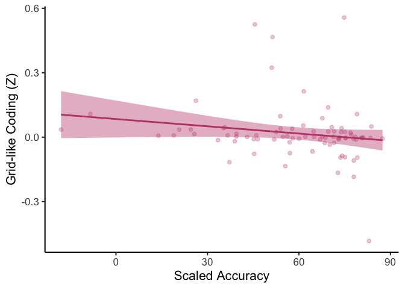

grid_analyses
================
2025-12-30

### Age differences in grid-like spatial representation in entorhinal cortex

- assess whether neural activity in entorhinal cortex suggests grid-like
  coding via permutation test (essentially an A/B test)
- the below analyses compute final comparisons, while data processing
  and permutation testing is implemented in associated Python files in
  high-performance computing (HPC) environment

``` r
data <- read.csv("data/erc_clust_vals.csv")

data <- data %>%
  mutate(group = case_when(
    age < 13 ~ 'child',
    age >= 18 ~ 'adult',
    TRUE ~ NA_character_  
  ))

child <- subset(data, group == 'child')
adult <- subset(data, group == 'adult')

# do extracted similarity values provide greater evidence of grid-like coding than would be expected by chance?
t.test(child$difference_60_minus_30, mu = 0, alternative = 'greater')
```

    ## 
    ##  One Sample t-test
    ## 
    ## data:  child$difference_60_minus_30
    ## t = 1.8848, df = 56, p-value = 0.03232
    ## alternative hypothesis: true mean is greater than 0
    ## 95 percent confidence interval:
    ##  0.003165738         Inf
    ## sample estimates:
    ##  mean of x 
    ## 0.02810446

``` r
t.test(adult$difference_60_minus_30, mu = 0, alternative = 'greater')
```

    ## 
    ##  One Sample t-test
    ## 
    ## data:  adult$difference_60_minus_30
    ## t = -0.13405, df = 25, p-value = 0.5528
    ## alternative hypothesis: true mean is greater than 0
    ## 95 percent confidence interval:
    ##  -0.06070539         Inf
    ## sample estimates:
    ##    mean of x 
    ## -0.004417443

    ## [1] 20 57 59 64

    ## 
    ##  One Sample t-test
    ## 
    ## data:  chi$difference_60_minus_30
    ## t = 1.5764, df = 55, p-value = 0.06033
    ## alternative hypothesis: true mean is greater than 0
    ## 95 percent confidence interval:
    ##  -0.001178741          Inf
    ## sample estimates:
    ##  mean of x 
    ## 0.01923225

    ## 
    ##  One Sample t-test
    ## 
    ## data:  ad$difference_60_minus_30
    ## t = -0.23721, df = 22, p-value = 0.5927
    ## alternative hypothesis: true mean is greater than 0
    ## 95 percent confidence interval:
    ##  -0.03401989         Inf
    ## sample estimates:
    ##    mean of x 
    ## -0.004129232

    ## Scale for colour is already present.
    ## Adding another scale for colour, which will replace the existing scale.

    ## Warning: Removed 3 rows containing missing values or values outside the scale range (`geom_point()`).

<!-- -->

``` r
# assess effect of grid-like coding on behavior
m  <- lm(scaled_accuracy ~ age + difference_60_minus_30, data = data)
summary(m)
```

    ## 
    ## Call:
    ## lm(formula = scaled_accuracy ~ age + difference_60_minus_30, 
    ##     data = data)
    ## 
    ## Residuals:
    ##     Min      1Q  Median      3Q     Max 
    ## -72.153  -8.949   1.826  10.594  30.339 
    ## 
    ## Coefficients:
    ##                        Estimate Std. Error t value Pr(>|t|)    
    ## (Intercept)             32.0530     4.7903   6.691 2.76e-09 ***
    ## age                      2.0132     0.3218   6.256 1.83e-08 ***
    ## difference_60_minus_30 -29.3429    14.2931  -2.053   0.0433 *  
    ## ---
    ## Signif. codes:  0 '***' 0.001 '**' 0.01 '*' 0.05 '.' 0.1 ' ' 1
    ## 
    ## Residual standard error: 17.12 on 80 degrees of freedom
    ##   (3 observations deleted due to missingness)
    ## Multiple R-squared:   0.35,  Adjusted R-squared:  0.3337 
    ## F-statistic: 21.54 on 2 and 80 DF,  p-value: 3.292e-08

``` r
anova_results <- anova(m)
eta_sq_results <- eta_squared(m, partial = TRUE)
eta_sq_results <- as.data.frame(eta_sq_results)
eta_sq_results[] <- lapply(eta_sq_results, \(x) if(is.numeric(x)) round(x, 3) else x)
eta_sq_results
```

    ##                Parameter Eta2_partial   CI CI_low CI_high
    ## 1                    age        0.327 0.95  0.194       1
    ## 2 difference_60_minus_30        0.050 0.95  0.001       1

``` r
m  <- lm(scaled_accuracy ~ age + difference_60_minus_30, data = data)

ggplot(data, aes(x = scaled_accuracy, y = difference_60_minus_30)) +
  # subject-level points
  geom_point(alpha = 0.3, size = 2, color = "#c04678") +
  geom_smooth(method = "lm",
              formula = y ~ x,
              se = TRUE,
              color = "#c04678",  
              fill = "#c04678") +  
  labs(
    x = "Scaled Accuracy",
    y = "Grid-like Coding (Z)"
  ) +
  theme_classic(base_size = 16)
```

    ## Warning: Removed 3 rows containing non-finite outside the scale range (`stat_smooth()`).

    ## Warning: Removed 3 rows containing missing values or values outside the scale range (`geom_point()`).

<!-- -->
