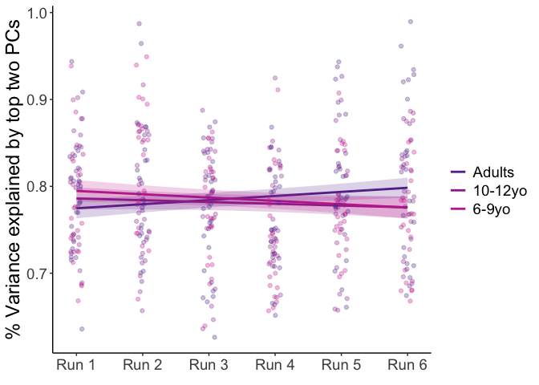
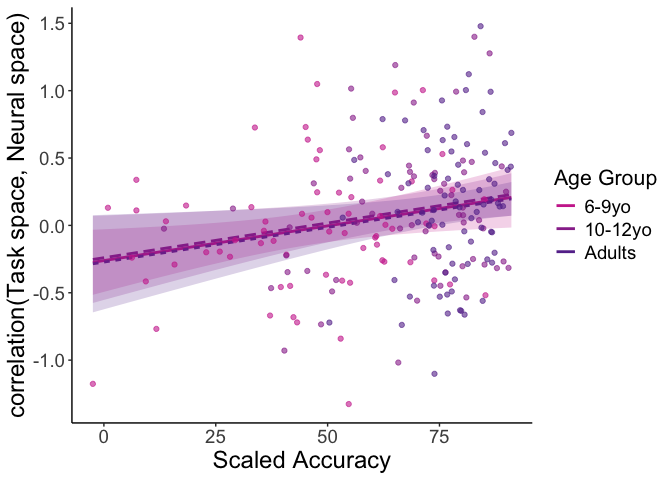

pca_analyses
================
2025-12-30

### Compression of spatial information into low-dimensional cognitive maps

- to identify regions which compress spatial information across the task
  (and which do so differently by age group), we use voxelwise
  mixed-effects regression
  1)  for item-level representations within each subject, we iteratively
      sweep a searchlight sphere across the brain, perform PCA, and
      exteract the % of variance explained by the top 2 principal
      components
  2)  after transforming resulting variance maps into template space, we
      again iteratively sweet across the brain and implement a
      mixed-effects model with terms for age group, run, their
      interaction, and overall task performance, along with
      subject-level random intercept terms.
  3)  from the above comparison, we compute (1-p) maps to identify
      contiguous clusters in which we find an age group by run
      interaction
  4)  finally, we back-project the corrected cluster from above (in the
      hippocampal tail) into each subject’s native space to extract
      changes in variance and similarity between items
- this requires several millions of comparisons and must be implemented
  in parallel in high-performance computing (HPC) environment
- the below mixed-effects model is confirmatory, illustrating an
  age-by-run interaction within the hippocampal cluster identified via
  voxelwise mixed-effects regression
  - for voxelwise PCA searchlight, see associated Python files for
    implementation in HPC environments

``` r
data = read.csv('data/var_top2_PCs_by_run.csv')

# here we plot w/ run as continuous, but effect is identical when treating run as categorical
data$run <- as.numeric(data$run)
data$subject <- as.factor(data$subject)

# confirmatory model
data$age_group <- relevel(factor(data$age_group), ref = 'Adults')
m <- lmer(var12 ~ age_group*run + (1|subject), data = data)
summary(m)
```

    ## Linear mixed model fit by REML. t-tests use Satterthwaite's method ['lmerModLmerTest']
    ## Formula: var12 ~ age_group * run + (1 | subject)
    ##    Data: data
    ## 
    ## REML criterion at convergence: -1543.3
    ## 
    ## Scaled residuals: 
    ##     Min      1Q  Median      3Q     Max 
    ## -2.4387 -0.6348 -0.1553  0.5446  3.4131 
    ## 
    ## Random effects:
    ##  Groups   Name        Variance  Std.Dev.
    ##  subject  (Intercept) 0.0002695 0.01642 
    ##  Residual             0.0012667 0.03559 
    ## Number of obs: 432, groups:  subject, 72
    ## 
    ## Fixed effects:
    ##                        Estimate Std. Error         df t value Pr(>|t|)    
    ## (Intercept)            0.769977   0.007116 336.844983 108.197  < 2e-16 ***
    ## age_group10-12yo       0.018120   0.010621 336.844983   1.706 0.088908 .  
    ## age_group6-9yo         0.028539   0.010493 336.844983   2.720 0.006868 ** 
    ## run                    0.004723   0.001637 357.000001   2.884 0.004158 ** 
    ## age_group10-12yo:run  -0.006777   0.002444 357.000001  -2.773 0.005839 ** 
    ## age_group6-9yo:run    -0.008546   0.002414 357.000001  -3.540 0.000453 ***
    ## ---
    ## Signif. codes:  0 '***' 0.001 '**' 0.01 '*' 0.05 '.' 0.1 ' ' 1
    ## 
    ## Correlation of Fixed Effects:
    ##             (Intr) ag_10-12 ag_6-9 run    a_10-12:
    ## ag_grp10-12 -0.670                                
    ## age_grp6-9y -0.678  0.454                         
    ## run         -0.805  0.540    0.546                
    ## ag_gr10-12:  0.540 -0.805   -0.366 -0.670         
    ## ag_grp6-9y:  0.546 -0.366   -0.805 -0.678  0.454

``` r
anova(m)
```

    ## Type III Analysis of Variance Table with Satterthwaite's method
    ##                  Sum Sq   Mean Sq NumDF  DenDF F value    Pr(>F)    
    ## age_group     0.0097242 0.0048621     2 336.84  3.8383 0.0224785 *  
    ## run           0.0001851 0.0001851     1 357.00  0.1462 0.7024648    
    ## age_group:run 0.0180401 0.0090200     2 357.00  7.1207 0.0009282 ***
    ## ---
    ## Signif. codes:  0 '***' 0.001 '**' 0.01 '*' 0.05 '.' 0.1 ' ' 1

``` r
# effect size
anova_results <- anova(m)
eta_sq_results <- eta_squared(m, partial = TRUE)
eta_sq_results <- as.data.frame(eta_sq_results)
eta_sq_results[] <- lapply(eta_sq_results, \(x) if(is.numeric(x)) round(x, 3) else x)
eta_sq_results
```

    ##       Parameter Eta2_partial   CI CI_low CI_high
    ## 1     age_group        0.022 0.95  0.002       1
    ## 2           run        0.000 0.95  0.000       1
    ## 3 age_group:run        0.038 0.95  0.010       1

<!-- -->

``` r
# directional t-tests to identify correspondence between neural space and behavioral space
# see associated jupyter notebook for plotting of the below
data <- read.csv('data/task_neural_space_corr.csv')

data <- subset(data, run > 3)

data <- data %>%
  group_by(subject, age_group) %>%
  summarise(across(where(is.numeric), mean), .groups = "drop")

adu <- subset(data, age_group == 'Adults')
ado <- subset(data, age_group == '10-12yo')
chi <- subset(data, age_group == '6-9yo')

t.test(adu$z, mu = 0, alternative = 'greater')
```

    ## 
    ##  One Sample t-test
    ## 
    ## data:  adu$z
    ## t = 2.0867, df = 26, p-value = 0.02343
    ## alternative hypothesis: true mean is greater than 0
    ## 95 percent confidence interval:
    ##  0.02354701        Inf
    ## sample estimates:
    ## mean of x 
    ## 0.1289498

``` r
t.test(ado$z, mu = 0, alternative = 'greater')
```

    ## 
    ##  One Sample t-test
    ## 
    ## data:  ado$z
    ## t = 1.6302, df = 21, p-value = 0.05898
    ## alternative hypothesis: true mean is greater than 0
    ## 95 percent confidence interval:
    ##  -0.006030251          Inf
    ## sample estimates:
    ## mean of x 
    ## 0.1085814

``` r
t.test(chi$z, mu = 0, alternative = 'greater')
```

    ## 
    ##  One Sample t-test
    ## 
    ## data:  chi$z
    ## t = -0.38881, df = 22, p-value = 0.6494
    ## alternative hypothesis: true mean is greater than 0
    ## 95 percent confidence interval:
    ##  -0.111151       Inf
    ## sample estimates:
    ##   mean of x 
    ## -0.02052104

    ## Linear mixed model fit by REML. t-tests use Satterthwaite's method ['lmerModLmerTest']
    ## Formula: z ~ scaled_accuracy + age_group + (1 | subject)
    ##    Data: data
    ## 
    ## REML criterion at convergence: 321.8
    ## 
    ## Scaled residuals: 
    ##      Min       1Q   Median       3Q      Max 
    ## -2.69937 -0.70413 -0.02941  0.58165  2.87812 
    ## 
    ## Random effects:
    ##  Groups   Name        Variance Std.Dev.
    ##  subject  (Intercept) 0.005932 0.07702 
    ##  Residual             0.236591 0.48641 
    ## Number of obs: 214, groups:  subject, 72
    ## 
    ## Fixed effects:
    ##                    Estimate Std. Error         df t value Pr(>|t|)  
    ## (Intercept)       -0.261040   0.117799 116.284200  -2.216   0.0286 *
    ## scaled_accuracy    0.005150   0.002161 140.925692   2.383   0.0185 *
    ## age_group10-12yo   0.021093   0.097959  79.235020   0.215   0.8301  
    ## age_groupAdults   -0.011052   0.107162  91.646278  -0.103   0.9181  
    ## ---
    ## Signif. codes:  0 '***' 0.001 '**' 0.01 '*' 0.05 '.' 0.1 ' ' 1
    ## 
    ## Correlation of Fixed Effects:
    ##             (Intr) scld_c a_10-1
    ## scald_ccrcy -0.857              
    ## ag_grp10-12  0.077 -0.463       
    ## ag_grpAdlts  0.249 -0.631  0.643

    ## Warning: scaled_accuracy and age_group are not included in an interaction with one another in the model.

<!-- -->
